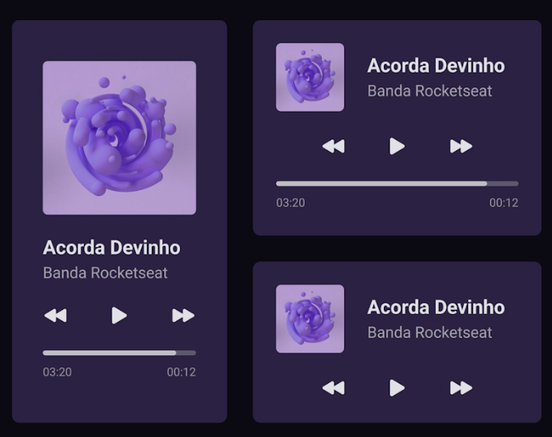

# Player de música

Codar um player de músicA com HTML e CSS (PURO)

## 🛠️ Tecnologias
- HTML;
- CSS;

### Figma
[[layout](https://www.figma.com/community/file/1195050524500542670/player-de-musica-desafio-01)]